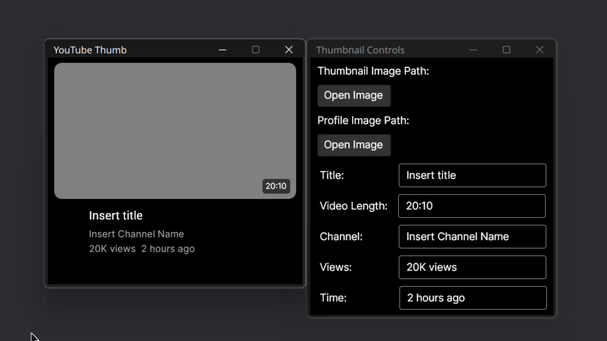

# YouTube Thumb

A program designed to test thumbnails.

## Overview
YouTube Thumb is a tool created to help test and evaluate YouTube thumbnails. This repository contains the complete solution including the program files and related assets.

## Preview

## Repository Contents
- `YouTubeThumb.sln`: The solution file containing the complete project
- `Program.png`: Screenshot or image of the program
- `.gitignore`: Git ignore file for the project
- `README.md`: This documentation file

## Last Updates
- README created: March 01, 2025 (just now)
- Program assets updated: March 01, 2025 (within last 19 minutes)

## Status
This is the complete version of the project as of March 01, 2025.
